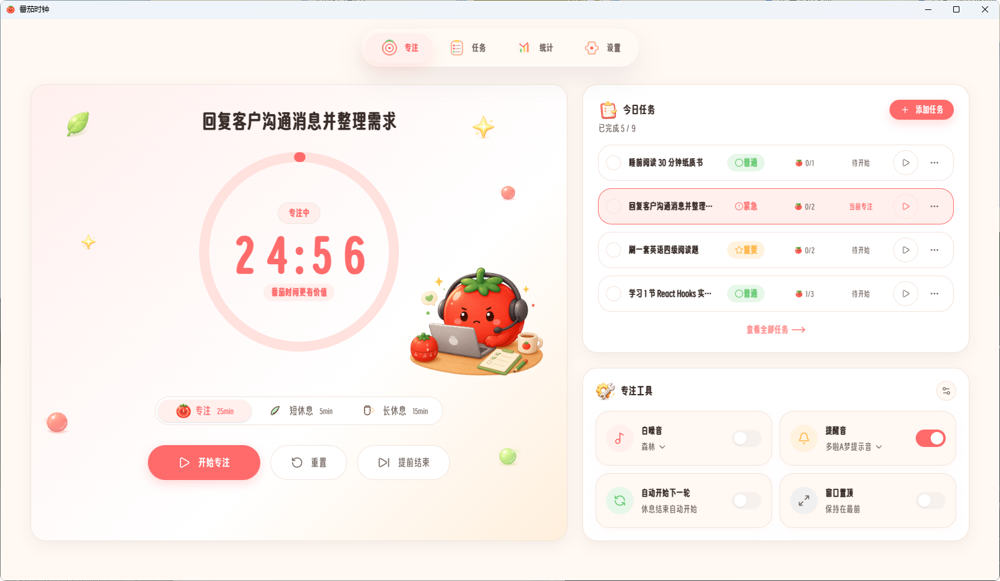
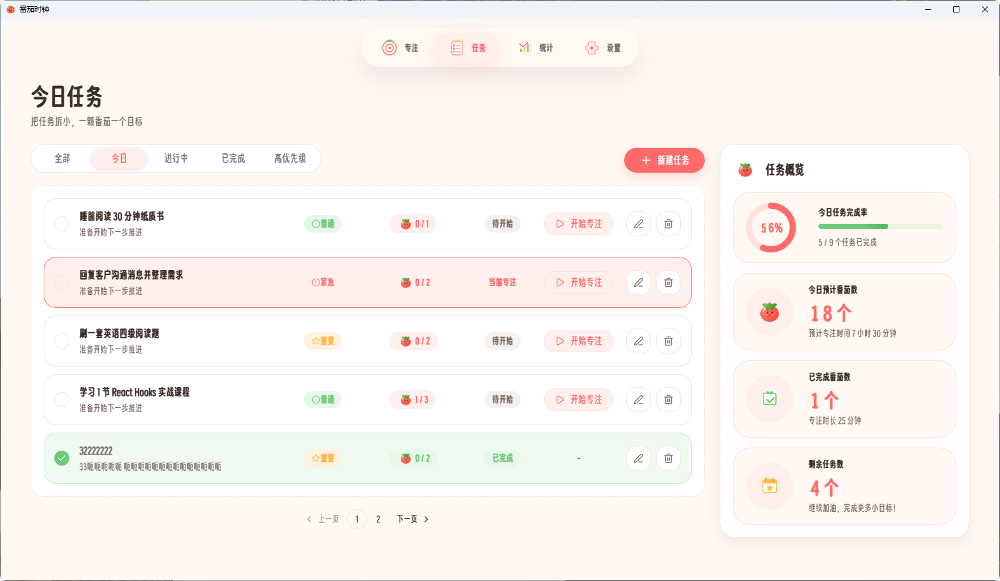
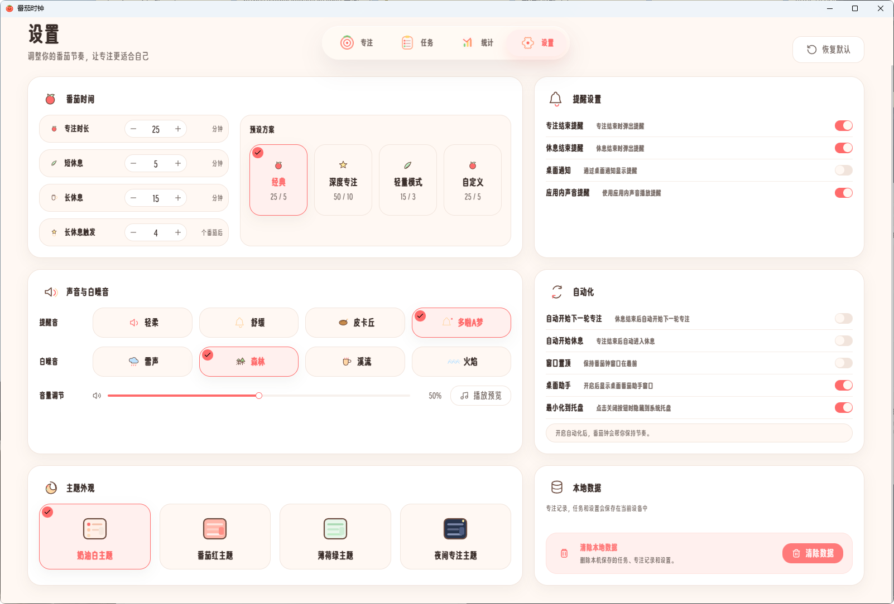

<p align="center">
  
</p>

<p align="center">
  <strong>一款治愈系桌面番茄钟，让专注变成一件温暖的事</strong>
</p>

<p align="center">
  <a href="#功能特性">功能特性</a> ·
  <a href="#系统架构">系统架构</a> ·
  <a href="#快速开始">快速开始</a> ·
  <a href="#技术栈">技术栈</a> ·
  <a href="#项目结构">项目结构</a> ·
  <a href="#参与贡献">参与贡献</a>
</p>

<p align="center">
  
  
  
  
  
  
</p>

---

**Cute Tomato Focus（番茄时钟）** 是一款基于 Tauri 2 构建的跨平台桌面番茄钟应用。以「可爱但不幼稚、治愈但不杂乱」为设计理念，将番茄工作法与任务管理、数据统计、Live2D 桌面助手等功能融为一体，帮助你在轻松愉悦的氛围中保持高效专注。

## 功能特性

### 番茄计时器

- 三种内置预设：经典（25/5/15）、深度专注（50/10/20）、轻量（15/3/10），支持完全自定义
- 专注 / 短休息 / 长休息模式一键切换
- 自动开始下一轮、自动进入休息等自动化选项
- 环形进度条 + 数字翻滚动画时间显示

### 任务管理

- 创建、编辑、删除任务，支持优先级（普通 / 重要 / 紧急）
- 预估番茄数与实际完成进度跟踪
- 任务筛选（全部 / 进行中 / 已完成 / 重要）与分页浏览
- 任务与番茄钟联动：选择任务后直接开始专注

### 数据统计

- 今日 / 本周 / 本月多维度统计面板
- 专注趋势折线图、任务完成分布、高效时段分析、时长分布
- 连续打卡天数、任务完成率、与上一周期对比
- 成长总结卡片

### 成就系统

- 6 大类 24 个成就：习惯养成、番茄累计、每日目标、每周目标、任务里程碑、特殊时刻
- 精美的锁定/解锁图标与积分奖励
- 成就抽屉面板展示全部进度

### Live2D 桌面助手

- 内置 8 款 Live2D 模型（Hiyori、Haru、Mao 等）
- 根据计时器状态自动切换表情和语音气泡
- 支持拖拽、摸头、加油、撒花等互动彩蛋
- 原生右键菜单：模型控制、专注联动、快捷操作
- 可独立窗口运行，支持位置锁定和窗口置顶

### 音频体验

- 4 种提醒音效：轻柔、舒缓、皮卡丘、多啦A梦
- 4 种白噪音：雨声、森林、溪流、火焰
- 全局音量调节与实时预览

### 主题与桌面集成

- 4 套主题配色：奶油（默认）、番茄、薄荷、暗黑专注
- 系统托盘常驻，支持最小化到托盘
- 桌面通知提醒（Tauri 原生通知）
- 窗口置顶选项

## 截图预览

| 专注工作区 | 任务管理 |
|:---:|:---:|
|  |  |

| 数据统计 | 应用设置 |
|:---:|:---:|
|  |  |

<p align="center">
  
  <br />
  <em>Live2D 桌面助手</em>
</p>

## 快速开始

### 环境要求

| 依赖 | 版本 |
|------|------|
| [Node.js](https://nodejs.org/) | >= 18 |
| [pnpm](https://pnpm.io/) | >= 8 |
| [Rust](https://www.rust-lang.org/tools/install) | >= 1.77 |
| Tauri 2 系统依赖 | 参考 [Tauri 官方文档](https://v2.tauri.app/start/prerequisites/) |

### 安装与运行

```bash
# 克隆仓库
git clone https://github.com/your-username/aural-pomodoro-timer.git
cd aural-pomodoro-timer

# 安装依赖
pnpm install

# 启动开发服务器（仅前端）
pnpm dev

# 启动 Tauri 桌面应用（前端 + Rust 后端）
pnpm tauri:dev
```

### 构建生产版本

```bash
# 构建当前平台安装包
pnpm tauri:build

# 构建调试版本（含 DevTools）
pnpm tauri:build:debug
```

### 跨平台构建

针对不同平台单独打包（跨平台编译需先安装对应 Rust target：`rustup target add <target-triple>`）：

| 命令 | 目标平台 |
|------|---------|
| `pnpm tauri:build:win-x64` | Windows x86_64 |
| `pnpm tauri:build:win-arm64` | Windows ARM64 |
| `pnpm tauri:build:mac-x64` | macOS Intel |
| `pnpm tauri:build:mac-arm64` | macOS Apple Silicon |
| `pnpm tauri:build:mac-universal` | macOS 通用二进制（Universal） |
| `pnpm tauri:build:linux-x64` | Linux x86_64 |
| `pnpm tauri:build:linux-arm64` | Linux ARM64 |

### 可用脚本

| 命令 | 说明 |
|------|------|
| `pnpm dev` | 启动 Vite 开发服务器 |
| `pnpm build` | 类型检查 + 构建前端 |
| `pnpm test` | 运行 Vitest 测试 |
| `pnpm tauri:dev` | 启动 Tauri 开发模式 |
| `pnpm tauri:build` | 构建当前平台安装包 |
| `pnpm tauri:build:debug` | 构建调试版本 |
| `pnpm lint` | ESLint 代码检查 |
| `pnpm lint:fix` | ESLint 自动修复 |
| `pnpm format` | Prettier 格式化 |
| `pnpm format:check` | Prettier 格式检查 |
| `pnpm release <version>` | 一键发版（见下方说明） |

### 一键发版

项目集成了 GitHub Actions 自动构建发版流程。运行一条命令即可完成版本号同步、打 tag、推送，并自动触发 CI 构建全平台安装包发布到 GitHub Releases：

```bash
pnpm release 0.2.0
```

该命令会依次执行：

1. 同步更新 `package.json`、`src-tauri/tauri.conf.json`、`src-tauri/Cargo.toml` 中的版本号
2. 创建 `release: v0.2.0` 提交
3. 打 `v0.2.0` tag 并推送到远程仓库
4. 自动触发 GitHub Actions，并行构建三个平台的安装包：

| 平台 | 产物 |
|------|------|
| Windows x64 | `.exe`（NSIS） |
| macOS Universal | `.dmg` |
| Linux x64 | `.deb` / `.AppImage` |

构建完成后安装包会自动发布到 [GitHub Releases](../../releases) 页面。

## 技术栈

### 前端

| 技术 | 用途 |
|------|------|
| **React 19** | UI 框架 |
| **TypeScript 5.8** | 类型安全 |
| **Vite 7** | 构建工具 |
| **Tailwind CSS 4** | 原子化样式 |
| **shadcn/ui** + Radix UI | 无障碍组件库 |
| **Zustand 5** | 状态管理（含 localStorage 持久化） |
| **React Router 7** | 客户端路由（HashRouter） |
| **Framer Motion 12** | 页面过渡与交互动画 |
| **Recharts 3** | 数据可视化图表 |
| **pixi-live2d-display** + PixiJS | Live2D 模型渲染 |
| **Lucide React** | 图标库 |
| **dayjs** | 日期处理 |
| **Vitest** + Testing Library | 单元测试 |

### 后端 / 桌面

| 技术 | 用途 |
|------|------|
| **Tauri 2** | 桌面应用框架 |
| **Rust** | 原生后端逻辑 |
| **tauri-plugin-notification** | 系统通知 |
| **tauri-plugin-opener** | 外部链接打开 |


## 项目结构

```
aural-pomodoro-timer/
├── src/                          # 前端源码
│   ├── assets/                   # 图片、图标、音频、成就图标、吉祥物
│   ├── components/
│   │   ├── assistant/            # Live2D 桌面助手组件
│   │   ├── common/               # 通用组件（AppButton、AppCard、ProgressRing 等）
│   │   ├── layout/               # 布局组件（AppShell、AppHeader、PageLayout）
│   │   ├── modal/                # 全局弹窗系统（9 种弹窗类型）
│   │   ├── settings/             # 设置页各区块组件
│   │   ├── stats/                # 统计卡片
│   │   ├── task/                 # 任务卡片、编辑器、工具栏、概览面板
│   │   ├── timer/                # 计时器面板、专注任务卡片、工具栏
│   │   └── ui/                   # shadcn/ui 基础组件
│   ├── constants/                # 配置常量（预设、存储键、助手配置）
│   ├── desktop/                  # Tauri 桌面集成（通知、窗口、事件）
│   ├── features/
│   │   ├── achievements/         # 成就系统（配置、Store、Hooks、组件）
│   │   ├── audio/                # 音频控制器（提醒音、白噪音）
│   │   └── focus/                # 专注任务绑定逻辑
│   ├── hooks/                    # 自定义 Hooks（计时器、助手命令）
│   ├── pages/                    # 页面组件（专注、任务、仪表盘、统计、设置）
│   ├── router/                   # 路由配置（懒加载）
│   ├── stores/                   # Zustand 状态管理
│   ├── styles/                   # 全局样式与设计令牌
│   ├── types/                    # TypeScript 类型定义
│   └── utils/                    # 工具函数（时间、统计、主题）
├── src-tauri/                    # Tauri / Rust 后端
│   ├── src/lib.rs                # 系统托盘、原生菜单、Tauri 命令
│   ├── Cargo.toml                # Rust 依赖
│   ├── tauri.conf.json           # Tauri 应用配置
│   └── icons/                    # 应用图标（多尺寸）
├── public/
│   └── resources/                # Live2D 模型资源（8 款模型）
├── package.json
├── vite.config.ts
├── tailwind.config.ts
└── tsconfig.json
```

## 路由结构

| 路由 | 页面 | 说明 |
|------|------|------|
| `/focus` | FocusWorkspace | 专注工作区（默认页） |
| `/tasks` | TaskManagement | 任务管理 |
| `/dashboard` | DashboardHome | 今日仪表盘 |
| `/statistics` | StatisticsDashboard | 数据统计与成就 |
| `/settings` | SettingsPage | 应用设置 |
| `/assistant` | DesktopAssistantPage | Live2D 助手独立窗口 |

## 参与贡献

欢迎通过以下方式参与贡献：

1. **Fork** 本仓库
2. 创建功能分支：`git checkout -b feature/your-feature`
3. 提交更改：`git commit -m "feat: add your feature"`
4. 推送分支：`git push origin feature/your-feature`
5. 创建 **Pull Request**

### 开发规范

- 提交信息遵循 [Conventional Commits](https://www.conventionalcommits.org/) 规范
- 提交前运行 `pnpm lint` 和 `pnpm test` 确保代码质量
- 组件使用函数式组件 + TypeScript，props 显式声明类型
- 样式使用 Tailwind CSS 工具类，遵循项目现有的设计令牌

### 问题反馈

如果你发现了 Bug 或有功能建议，请[创建 Issue](../../issues)。

## 致谢

- [Tauri](https://tauri.app/) — 高性能跨平台桌面框架
- [shadcn/ui](https://ui.shadcn.com/) — 精美可定制的 React 组件
- [Live2D Cubism SDK](https://www.live2d.com/) — Live2D 模型渲染技术
- [pixi-live2d-display](https://github.com/guansss/pixi-live2d-display) — PixiJS Live2D 插件

## 许可证

本项目基于 [MIT License](LICENSE) 开源。

---

<p align="center">
  用每一颗番茄，记录成长的痕迹 🍅
</p>
